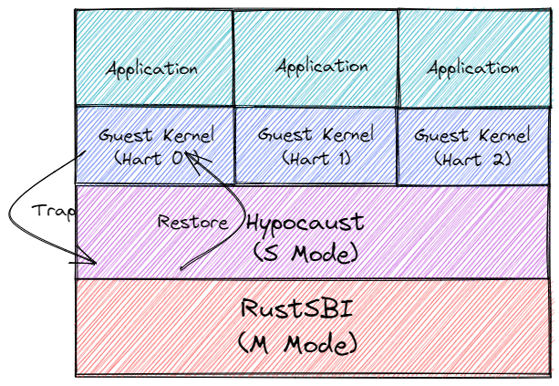
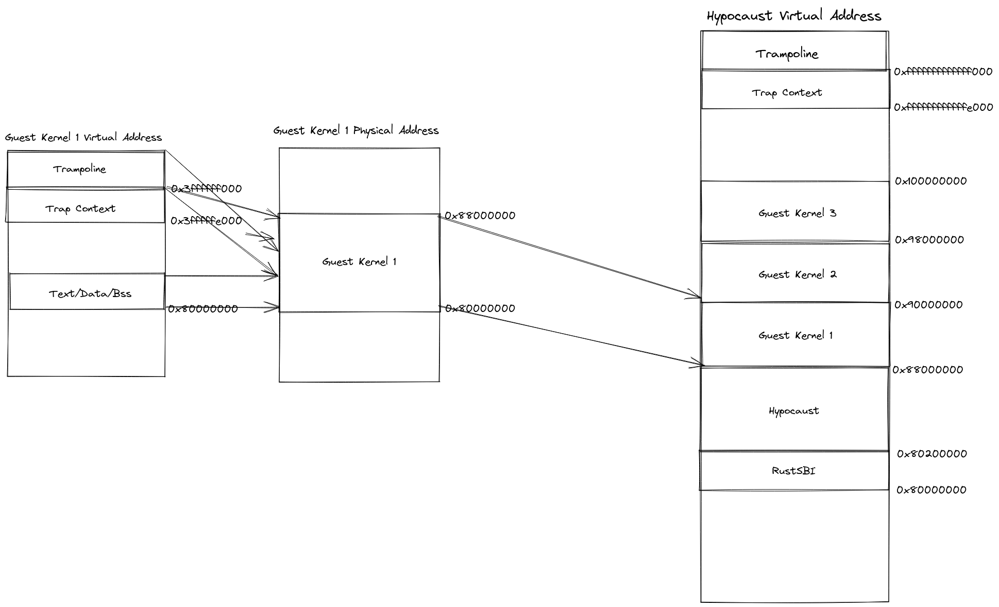

# Hypocaust
**Hypocaust** is an S-mode trap and emulate type-1 hypervisor for RISC-V. It is currently targeted at QEMU's virt machine type. It can run on [RustSBI](https://github.com/rustsbi/rustsbi) currently.  



## Environment
- QEMU 7.0.0
- rust 1.66.0

## Build 
```
git clone https://github.com/KuangjuX/hypocaust.git
cd hypocause
git submodule update --init

make qemu
```

## Memory Region
- DRAM Memory Region: 0x80000000 - 0x140000000 3GB   
- hypervisor: 128MB  
- Guest Kernel: 128MB 

### Hypervisor Memory Region
| HVA Start | HVA End | HPA Start | HPA End | Memory Region |
| --------------| ----------- | -------------- | ------------ | -------------  |
| 0x80000000    | 0x80200000  | 0x80000000     | 0x80200000   |RustSBI        |
| 0x80200000    | 0xC0000000  | 0x80200000     | 0x88000000   |hypervisor     |
| 0x88000000    | 0x8FFFFFFF  | 0x88000000 | 0x8FFFFFFF | Guest Kernel 1   |
| 0x90000000    | 0x97FFFFFF  | 0x90000000 | 0x97FFFFFF | Guest Kernel 2   |
| 0x98000000    | 0x9FFFFFFF  | 0x98000000 | 0x9FFFFFFF | Guest Kernel 3   |
| 0x100000000   | 0x17FFFFFFF | 0x100000000| 0x17FFFFFFF| Guest Kernel 1 Shadow Page Table |

### Resvered Memory Region
| VA Start | VA End | Memory Region |
| ---------|--------| -------------- |
| 0xFFFFFFFFFFFFF000 | 0xFFFFFFFFFFFFFFFF | Trampoline |
| 0xFFFFFFFFFFFFE000 | 0xFFFFFFFFFFFFEFFF | Trap Context |

### Guest Kernel Memory Region
| GVA | GPA | HVA | Memory Region |  
| ---- | ---- | ---- | ---- |  
| 0x80000000 - 0x87FFFFFF | 0x80000000 - 0x87FFFFFF | 0x88000000 - 0x8FFFFFFF | Guest Kernel 1 | 
| 0x80000000 - 0x87FFFFFF | 0x80000000 - 0x87FFFFFF | 0x90000000 - 0x97FFFFFF | Guest Kernel 2|
| 0x80000000 - 0x87FFFFFF | 0x80000000 - 0x87FFFFFF | 0x98000000 - 0x9FFFFFFF | Guest Kernel 3 |



## Supported Platforms
- QEMU virt machine type

## RoadMap
- [x] Load guest kernel && Run guest kernel
- [x] Trap and emulate of privileged instructions(CSR related and SFENCE>VMA)
- [x] Shadow page tables
- [x] Synchronize guest page table & shadow page table
- [x] Foward Expections & Interrupts
- [ ] Update PTE accessed and dirty bits
- [x] Timers
- [ ] Expose and/or emulate peripherals
- [ ] passthrough virtio block and networkd devices
- [ ] multicore supported
- [ ] multiguest supported

## References
- [rcore-os/rCore-Tutorial-v3](https://github.com/rcore-os/rCore-Tutorial-v3)
- [mit-pdos/RVirt](https://github.com/mit-pdos/RVirt)

## Questions
See also:
- [Synchronize satp & SPT](https://github.com/KuangjuX/hypocaust/issues/1)

## License
MIT License

Copyright (c) 2022 ChengXiang Qi

Permission is hereby granted, free of charge, to any person obtaining a copy
of this software and associated documentation files (the "Software"), to deal
in the Software without restriction, including without limitation the rights
to use, copy, modify, merge, publish, distribute, sublicense, and/or sell
copies of the Software, and to permit persons to whom the Software is
furnished to do so, subject to the following conditions:

The above copyright notice and this permission notice shall be included in all
copies or substantial portions of the Software.

THE SOFTWARE IS PROVIDED "AS IS", WITHOUT WARRANTY OF ANY KIND, EXPRESS OR
IMPLIED, INCLUDING BUT NOT LIMITED TO THE WARRANTIES OF MERCHANTABILITY,
FITNESS FOR A PARTICULAR PURPOSE AND NONINFRINGEMENT. IN NO EVENT SHALL THE
AUTHORS OR COPYRIGHT HOLDERS BE LIABLE FOR ANY CLAIM, DAMAGES OR OTHER
LIABILITY, WHETHER IN AN ACTION OF CONTRACT, TORT OR OTHERWISE, ARISING FROM,
OUT OF OR IN CONNECTION WITH THE SOFTWARE OR THE USE OR OTHER DEALINGS IN THE
SOFTWARE.

