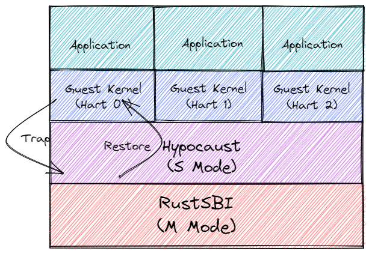

# Hypocaust

[](LICENSE)
[](#validated-platform)
[](#run-the-xv6-rust-example)
[](#run-the-linux-example)

Hypocaust is a type-1 RISC-V hypervisor that runs beneath OpenSBI in Host
S-mode and virtualizes Guest S-mode without requiring the RISC-V Hypervisor
extension. It uses shadow Sv39 page tables, per-VM resource ownership, trapped
privileged operations, and mediated devices to run isolated xv6-rust and Linux
Guests.

The validated QEMU configuration boots two xv6-rust VMs concurrently on two
Host harts, or time-slices both VMs on one Host hart. Each VM owns separate RAM,
shadow translation state, virtual interrupt state, virtual PLIC, console
frontend, VirtIO queue state, and writable disk image.

> [!IMPORTANT]
> Hypocaust is still a research hypervisor, not a hardened security boundary
> for hostile production workloads. The validated platform has no concrete
> RISC-V IOMMU adapter, VM lifecycle/control plane, live migration, or stable
> compatibility guarantee. See [Security and isolation](#security-and-isolation)
> and [Known limitations](#known-limitations).



## Project status

| Area | Current status |
| --- | --- |
| Multi-Guest | Two isolated xv6-rust VMs booted and tested |
| Scheduling | Multi-vCPU run queue; validated with one and two Host harts |
| Memory | Fixed per-VM 128 MiB RAM and shadow-page-table slots |
| Translation | Cached shadow Sv39 roots, ASIDs, incremental PTE synchronization |
| Storage | Per-VM mediated QEMU VirtIO block backend and writable disk |
| Interrupts | Per-vCPU pending state and per-VM virtual PLIC |
| Console | Per-VM buffered/labeled output; exclusive physical input focus |
| Linux | Two Alpine 3.24.1 Guests boot to VM-local initramfs shells |
| Exceptions | Synchronous Guest exceptions forwarded into the owning vCPU |
| Passthrough | Fail-closed IOMMU/IRQ-remap policy API; no QEMU hardware adapter |

## Architecture

```text
xv6-rust user processes (Guest U-mode)
                    |
xv6-rust kernel (virtual Guest S-mode)
                    | privileged instructions, PTE writes, SBI, MMIO
                    v
              VM-owned vCPU state
                    |
      +-------------+----------------+
      |                              |
shadow Sv39                    VM DeviceBus
GVA -> GPA -> HPA              virtual PLIC/console/VirtIO
      |                              |
      +-------------+----------------+
                    |
        Hypocaust Host S-mode scheduler
                    |
             OpenSBI M-mode
                    |
              QEMU `virt`
```

### Address translation

The Guest owns an Sv39 GVA→GPA page table. Hypocaust mirrors valid Guest
mappings into a hardware-walked shadow table whose leaves contain only Host
physical pages owned by that VM. Guest page-table pages are write-protected;
a trapped 64-bit PTE update is validated, mirrored incrementally, and followed
by an ASID-scoped TLB invalidation when required.

This avoids a software page-table walk on every Guest memory access: normal
loads, stores, and instruction fetches use the hardware TLB and shadow Sv39
tree. Full Guest walks occur when a new or stale shadow root must be built.
Cached root generations, valid-PTE counts, and ASIDs reduce that slow path.

`GuestMemory` also supports checked HPA→GPA lookup. That is reverse address
translation for ownership checks (for example, recognizing a trapped PTE
alias); it is not a reverse page-table walk and is O(1) for the current
contiguous VM slots.

Performance design and counters are documented in:

- [shadow-paging profiling](docs/shadow-paging-profile.md)
- [shadow root generation cache](docs/shadow-page-table-cache.md)
- [shadow page-table ASIDs](docs/shadow-page-table-asid.md)
- [incremental valid-PTE counts](docs/valid-pte-count.md)
- [invalid-leaf translation semantics](docs/invalid-leaf-translation.md)

### Device model

Every VM owns one `DeviceBus`. Guest MMIO faults are resolved through the
currently scheduled `VcpuKey`, then routed only to the bus owned by that VM.

The QEMU block implementation is mediated, not raw passthrough: Hypocaust traps
the Guest-visible VirtIO MMIO interface, validates and translates the complete
DMA range, tracks asynchronous completion, and injects the VM-local virtual
PLIC source. QEMU executes the storage request against that VM's disk image.

Real physical passthrough is a separate opt-in contract. It requires exclusive
device and Host-MMIO ownership, an IOMMU domain whose DMA aperture covers only
the owning VM's RAM, and explicit Host IRQ→Guest PLIC remapping. Platforms
without such an adapter must use mediated or emulated devices. See
[IOMMU-protected passthrough](docs/iommu-passthrough-policy.md).

### Interrupt and exception model

Physical timer/IPI/device interrupts belong to the Host. Device completion is
converted into pending state on one destination vCPU and one VM-local virtual
PLIC. The Guest observes only its virtual `sip`, `sie`, PLIC contexts, and
claim/complete state.

Synchronous exceptions caused by Guest execution remain vCPU-local. Hypocaust
emulates supported privileged instructions and MMIO accesses, then injects any
unsupported exception through that vCPU's shadow `scause`, `sepc`, `stval`,
`sstatus`, and `stvec`. Exceptions raised while Hypocaust itself executes, and
unexpected physical interrupts, remain Host-fatal integration errors. See
[Guest exception forwarding](docs/guest-exception-forwarding.md).

## Validated platform

| Component | Validated configuration |
| --- | --- |
| ISA | RV64GC with Sv39; H extension not required |
| Machine | QEMU `virt` |
| Firmware | QEMU bundled OpenSBI (`-bios default`) |
| Host harts | 1 (time-sliced) and 2 (concurrent) |
| Guests | 2 VMs, one vCPU each |
| Guest RAM | 128 MiB per VM |
| QEMU RAM | 3 GiB |
| Guest OS | xv6-rust SBI payload; Alpine Linux 3.24.1 initramfs shell |
| xv6-rust revision | `0e61a5e` (main, includes PRs #60 and #61) |
| QEMU | 11.1.1 |
| Rust | `nightly-2026-09-02` |

Other versions may work, but are not part of the current compatibility
baseline.

## Prerequisites

Install and place on `PATH`:

- Git and Make;
- Rust through [rustup](https://rustup.rs/);
- `qemu-system-riscv64`;
- `riscv64-unknown-elf-*` or `riscv64-elf-*` bare-metal C tools for xv6-rust
  userspace;
- a Host C compiler, Perl, and Python 3 for xv6-rust.

The repository pins the Rust toolchain and RISC-V target in
`rust-toolchain.toml`. Install the binary utilities used by `make asm` if
needed:

```sh
cargo install cargo-binutils --version 0.4.0 --locked
```

Verify the principal runtime tools:

```sh
rustc --version
qemu-system-riscv64 --version
```

## Run the xv6-rust example

xv6-rust is an external Guest example, not a Hypocaust submodule. Clone both
repositories as siblings; xv6-rust keeps its own required submodules.

```sh
git clone https://github.com/KuangjuX/hypocaust.git
git clone --recurse-submodules https://github.com/Ko-oK-OS/xv6-rust.git
git -C xv6-rust checkout 0e61a5e
git -C xv6-rust submodule update --init --recursive
cd hypocaust
make -C examples/xv6-rust run
```

The example:

1. builds the xv6-rust filesystem and single-hart SBI kernel;
2. copies the kernel ELF into Hypocaust's ignored `guest_kernel` input;
3. creates independent `fs-vm0.img` and `fs-vm1.img` writable disks;
4. embeds the Guest kernel and boots two VMs with `SMP=2`.

For a checkout in another location:

```sh
make -C examples/xv6-rust run \
  XV6_RUST_DIR=/absolute/path/to/xv6-rust
```

A successful boot contains both of these records:

```text
[Guest VM 0] file system: initialized by system thread
[Guest VM 1] file system: initialized by system thread
```

VM 0 initially owns physical console input. At its prompt, a smoke test is:

```text
[Guest VM 0] xv6 Rust >>> echo HYPOCAUST_OK
[Guest VM 0] HYPOCAUST_OK
```

Press `Ctrl-a`, then `x`, to exit QEMU. After artifacts are prepared,
`make qemu SMP=1` time-slices both VMs on one Host hart and `make qemu SMP=2`
runs them concurrently. Hypocaust never fetches, switches, cleans, or edits the
external xv6-rust checkout.

See the complete [xv6-rust example contract](examples/xv6-rust/README.md).

## Run the Linux example

Linux is also an external Guest example rather than a submodule. The reproducible
workflow pins Alpine Linux 3.24.1, verifies the official ISO checksum, extracts
its RISC-V lts kernel and initramfs, and boots two BusyBox shells:

```sh
make qemu-linux
```

Install `curl`, `gzip`, `bsdtar`, and either `sha256sum` or `shasum` in addition
to the base prerequisites. Generated artifacts stay in ignored paths and the
download cache stays under `target/`.

A successful boot reaches both records:

```text
[Guest VM 0] Run /bin/sh as init process
[Guest VM 1] Run /bin/sh as init process
```

VM 0 owns keyboard focus. The BusyBox shell is PID 1 and therefore reports that
job control is unavailable, but it accepts commands at its labelled `~ #`
prompt. Command execution is currently very slow because of the OpenSBI trap/log
limitation described below. See the complete
[Alpine Linux example contract](examples/linux/README.md).

## Build and development commands

| Command | Purpose |
| --- | --- |
| `make help` | Show supported workflows and path overrides |
| `make xv6-rust` | Rebuild and copy Guest kernel/two disk images |
| `make build` | Build Hypocaust with existing Guest artifacts |
| `make qemu SMP=1` | Boot two time-sliced VMs |
| `make qemu SMP=2` | Boot two concurrently running VMs |
| `make qemu-xv6 SMP=2` | Refresh Guest artifacts and boot |
| `make qemu-linux` | Verify Alpine artifacts and boot two initramfs shells |
| `make qemu-gdb` | Start QEMU paused with GDB on TCP port 1234 |
| `make asm` | Generate Host and Guest disassemblies |
| `make clean` | Remove Hypocaust outputs and copied Guest artifacts |

### Debug with GDB

In one terminal:

```sh
make qemu-gdb SMP=2
```

In another:

```sh
gdb-multiarch target/riscv64gc-unknown-none-elf/debug/hypocaust
(gdb) set architecture riscv:rv64
(gdb) target remote :1234
```

## Memory layout

| Region | Host physical range | Purpose |
| --- | --- | --- |
| Firmware | `0x8000_0000..0x8020_0000` | OpenSBI |
| Hypocaust | `0x8020_0000..0x8800_0000` | Host code/data/heap/page tables |
| VM 0 RAM | `0x8800_0000..0x9000_0000` | 128 MiB private Guest backing |
| VM 1 RAM | `0x9000_0000..0x9800_0000` | 128 MiB private Guest backing |
| VM 2 slot | `0x9800_0000..0xa000_0000` | reserved fixed-capacity slot |
| Shadow slots | `0x1_0000_0000..0x1_1800_0000` | three 128 MiB shadow arenas |

Each active Guest sees its own RAM at `0x8000_0000..0x8800_0000`. Host
trampoline and trap-context pages occupy the top two canonical virtual pages.
See the [memory layout diagram](docs/images/layout.png).

## Security and isolation

The current design enforces explicit VM ownership for Guest RAM, shadow page
tables, vCPUs, device buses, virtual interrupt state, PLICs, VirtIO backends,
disk images, and console buffers. Checked Guest-memory translation rejects DMA
or page-table ranges outside the owning VM.

These mechanisms have not undergone a security audit. Several Guest-facing
paths still use assertions for invariant failures, QEMU firmware is trusted,
and the no-H-extension execution model relies on OpenSBI trap behavior. Do not
run untrusted workloads or expose Hypocaust as a production security boundary.

Please report security-sensitive findings privately to the repository owner
before opening a public issue.

## Known limitations

- QEMU `virt` is the only validated board.
- Startup creates exactly two single-vCPU Guests from one embedded kernel.
- VM RAM/shadow slots and device assignments are compiled-in, not discovered
  from a production configuration/control plane.
- There is no hardware RISC-V IOMMU implementation; physical passthrough policy
  exists, but the example uses mediated devices.
- Legacy SBI console output is multiplexed onto one serial terminal; only one
  VM has input focus at a time.
- OpenSBI prints `system_opcode_insn: Invalid opcode ...` for deprivileged
  privileged instructions. Those M-mode diagnostics bypass Hypocaust's console
  lock and add substantial trap/log overhead.
- Guest `WFI` is currently emulated as a no-op, so idle Guests can consume Host
  CPU and generate extra firmware traps.
- A Guest shutdown request still lacks a VM lifecycle manager and must not be
  treated as production-grade per-VM power control.
- No live migration, snapshots, overcommit, ballooning, NUMA policy, or stable
  device ABI is provided.

## Repository layout

| Path | Purpose |
| --- | --- |
| `src/hypervisor/` | scheduler, trap entry, SBI/CSR emulation, Host runtime |
| `src/guest/` | VM/vCPU state, Guest memory, shadow-page-table lifecycle |
| `src/device_emu/` | per-VM PLIC, console, mediated VirtIO, passthrough policy |
| `src/mm/` | Host mappings and Guest ELF loading |
| `src/page_table/` | Sv39 page-table implementation |
| `src/constants/` | board and fixed memory-layout constants |
| `examples/xv6-rust/` | external Guest integration; no vendored Guest source |
| `examples/linux/` | verified Alpine artifact workflow; no vendored Guest source |
| `docs/` | focused architecture, performance, and PR design records |

There is no `.gitmodules` file. Neither minikernel nor xv6-rust is a
Hypocaust submodule.

## Troubleshooting

**`xv6-rust was not found`** — clone it at `../xv6-rust` or pass an absolute
`XV6_RUST_DIR`.

**RISC-V compiler not found** — install a bare-metal GCC toolchain and confirm
that `riscv64-unknown-elf-gcc` or `riscv64-elf-gcc` is on `PATH`.

**Guest boots but storage stalls** — verify xv6-rust is at `0e61a5e` or newer
and contains merged PRs #60 (SBI completion polling) and #61 (virtual PLIC
completion). Rebuild with `make xv6-rust`.

**Only one VM accepts keyboard input** — expected: VM 0 owns the initial
physical console focus. Multiple independent interactive terminals require a
future PTY/socket or virtio-console backend.

**Large volumes of `system_opcode_insn` output** — emitted by the bundled
OpenSBI diagnostic path, not Hypocaust's logger. Use the pinned QEMU baseline
for comparable profiling; a compatible firmware/H-extension path is required
to remove it.

**Port 1234 is busy** — stop the other debugger or change the port in both the
QEMU and GDB commands.

## Contributing

Keep changes focused and submit each feature or bug fix independently. Branch
names use `feature/<description>` or `fix-bug/<description>`. Pull requests
must explain the problem, design, invariants, validation evidence, performance
impact where relevant, and known follow-ups. Non-obvious code needs a comment
describing its purpose and the PR that introduced it.

Before opening a PR:

```sh
cargo build --features embed_guest_kernel
cargo build --release --features embed_guest_kernel
git diff --check
```

Virtualization changes must also boot the xv6-rust example and exercise the
affected path on the appropriate `SMP` configuration.

## Related work

- [hypocaust-2](https://github.com/KuangjuX/hypocaust-2), a hardware-assisted
  virtualization successor
- [xv6-rust](https://github.com/Ko-oK-OS/xv6-rust), the validated Guest OS
- [RVirt](https://github.com/mit-pdos/RVirt)
- [rCore Tutorial](https://github.com/rcore-os/rCore-Tutorial-v3)

## License

Hypocaust is available under the [MIT License](LICENSE).
